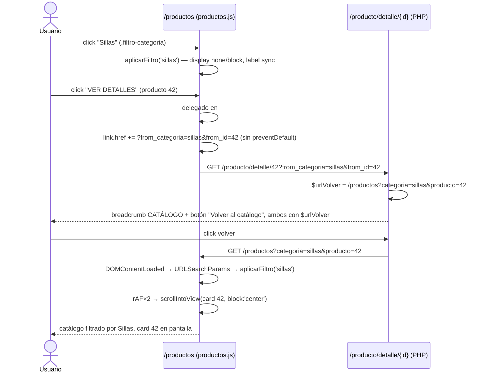

# Design: Rediseño de la Página de Detalle de Producto

## Technical Approach

Two disjoint, additive halves. (A) A **URL-addressable round trip** for the client-side catalog filter: `productos.js` writes the active category + product id onto the "VER DETALLES" href at click time; `detalle_producto.php` echoes those params back into its return links; `productos.js` reads them on load, re-applies the filter and anchors scroll. No controller, model, route or session change. (B) A **markup/CSS restyle** of `trust-badges`, `description-box` and `features-list` using classes already validated on `informacionContacto.php`. `.actions-area` is untouched.

Verified against source (not assumed):
- `productos.php:61` emits `data-categorias="<?= esc($row['categoria']) ?>"`; `productos.php:51` emits `data-categoria="<?= esc($cat['descripcion']) ?>"`. **Same string source** — there is no slug layer. Comparison is already `toLowerCase()` on both sides (`productos.js:93,97`).
- `product_card.php` has `data-producto-id` only on `.btn-fav-artisan`, and **only when logged in**. A stable, session-independent hook is missing.
- The site kicker classes are `kicker-spacing-2` / `kicker-spacing-3` (not `kicker-spacing`), and light sections use `text-vivid`, dark ones `text-gold`.
- Current asset versions: `detalle_producto.css?v=5.2`, `detalle-producto.js?v=1.0`, `productos.js?v=1.1`, `productos.css?v=14.0`.

## Architecture Decisions

| # | Decision | Choice | Alternatives rejected | Rationale |
|---|---|---|---|---|
| D1 | Where the param is produced | Client-side, on click | PHP emits it in `product_card.php` | The active category exists only in the browser; `product_card.php` is shared with `mis_favoritos.php`, which has no filter context. |
| D2 | Listener strategy | **Event delegation on `#lista-productos`** | One listener per card | Cards are never regenerated (only `style.display` toggles), so direct listeners would work — but delegation is one listener instead of N, survives any future re-render, and matches the container-scoping already used to keep favorites logic out of `mis_favoritos.php`. |
| D3 | Param vocabulary | Detail URL: `?from_categoria=&from_id=`. Catalog return URL: `?categoria=&producto=`, with `from_categoria`/`from_id` accepted as aliases by the reader | One name everywhere | The catalog URL is user-visible/bookmarkable, so it reads naturally; the alias keeps a single parser and makes a hand-edited or older link still work. |
| D4 | Category value format | `encodeURIComponent(categoria.toLowerCase())` of the raw description — **no slugification** | Introduce a slug (`sillas-y-bancos`) | There is no slug anywhere in the data path; inventing one creates the exact mismatch listed as a proposal risk. |
| D5 | href mutation | Mutate `href` in the click handler, never `preventDefault()` | `<a>` pre-built server-side / JS-driven `location.assign` | The server-rendered `href` stays a valid plain detail URL, so with JS disabled the link still navigates — it just loses the return state. Progressive enhancement. |
| D6 | Anchor mechanism | `scrollIntoView` on `[data-producto-id]` | Pixel/scroll-offset restore, `#hash` anchor | Immune to layout shift and to the filter changing document height; a removed product simply no-ops. |
| D7 | features-list content | Stays hardcoded, restyle only | Dynamic from product data | Confirmed in the proposal question round; dynamic content would require `ProductoController`/model changes, explicitly out of scope. |
| D8 | Back affordance | Breadcrumb **and** dedicated button, both active, both from one computed `$urlVolver` | Replace breadcrumb with button | Confirmed in the question round; one shared PHP variable guarantees the two can never diverge. |

## Data Flow

    productos.php (filter buttons + cards)
         │  click .filtro-categoria ──→ aplicarFiltro(categoria)  ──→ style.display on #lista-productos > div
         │  click a.js-ver-detalles  ──→ delegated handler ──→ href += ?from_categoria&from_id
         ▼
    detalle_producto.php  ── $fromCat/$fromId (GET, optional) ──→ $urlVolver
         │  breadcrumb "CATÁLOGO" + .btn-volver-catalogo ──→ /productos?categoria=X&producto=Y
         ▼
    productos.js DOMContentLoaded ──→ URLSearchParams ──→ aplicarFiltro(X) ──→ scrollIntoView(Y)

## Interfaces / Contracts

### 1. Card hook (`app/Views/components/product_card.php`)

```php
<div class="product-card h-100 d-flex flex-column"
     data-aos="fade-up"
     data-producto-id="<?= esc($producto['id_producto']) ?>">
```

```php
<a href="<?= base_url('producto/detalle/' . $producto['id_producto']) ?>"
   class="btn btn-artisan-gold w-100 fw-bold js-ver-detalles">VER DETALLES</a>
```

Both are inert additions: `mis_favoritos.php` renders the same attributes but has no `#lista-productos` container, so no listener ever binds.

### 2. `aplicarFiltro` extraction (`public/assets/js/pages/productos.js`)

Today (`productos.js:88–114`) the click handler does five things inline: (1) swap `.active` on the buttons, (2) lowercase `dataset.categoria`, (3) loop `#lista-productos > div` toggling `style.display`, (4) sync `.filtro-activo-label`, (5) hide the mobile offcanvas. Steps 1–4 must be replayable on load; step 5 must not run on load (there is no open offcanvas).

```js
// Returns the matched button, or null when the category is unknown.
function aplicarFiltro(categoria, opts) {
    const cat = String(categoria || 'todos').toLowerCase();
    const btn = Array.from(botones).find(b => b.dataset.categoria.toLowerCase() === cat) || null;
    if (!btn) return null;                                   // unknown category -> caller falls back
    botones.forEach(b => b.classList.toggle('active', b === btn));
    document.querySelectorAll('#lista-productos > div').forEach(prod => {
        const catProd = (prod.dataset.categorias || '').toLowerCase();
        prod.style.display = (cat === 'todos' || catProd === cat) ? 'block' : 'none';
    });
    if (filtroActivoLabel) filtroActivoLabel.textContent = btn.textContent.trim();
    if (opts && opts.cerrarOffcanvas) { /* existing bootstrap.Offcanvas.getInstance(...).hide() */ }
    return btn;
}

botones.forEach(btn => btn.addEventListener('click',
    () => aplicarFiltro(btn.dataset.categoria, { cerrarOffcanvas: true })));
```

### 3. Outbound link decoration (delegated)

```js
const lista = document.getElementById('lista-productos');
if (lista) lista.addEventListener('click', function (e) {
    const link = e.target.closest('a.js-ver-detalles');
    if (!link || !lista.contains(link)) return;
    const activo = document.querySelector('.filtro-categoria.active');
    const cat = activo ? activo.dataset.categoria.toLowerCase() : 'todos';
    const card = link.closest('[data-producto-id]');
    const url = new URL(link.href, window.location.origin);  // absolute; keeps any existing query
    if (cat && cat !== 'todos') url.searchParams.set('from_categoria', cat);
    if (card) url.searchParams.set('from_id', card.dataset.productoId);
    link.href = url.toString();                              // no preventDefault -> normal navigation
});
```

`URL`/`searchParams` handle encoding, so `"Mesas y Sillas"` round-trips safely. `cat === 'todos'` writes nothing, keeping the default URL clean.

### 4. Return restore (on load, after the filter listeners are wired)

```js
const qs = new URLSearchParams(window.location.search);
const catVuelta = qs.get('categoria') || qs.get('from_categoria');
const idVuelta  = qs.get('producto')  || qs.get('from_id');
if (catVuelta) aplicarFiltro(catVuelta);                     // null return = silent fallback to "Todos"
if (idVuelta) {
    const card = document.querySelector(`#lista-productos [data-producto-id="${CSS.escape(idVuelta)}"]`);
    const col  = card && card.closest('#lista-productos > div');
    if (col && col.style.display !== 'none') {               // never scroll to a hidden node
        requestAnimationFrame(() => requestAnimationFrame(
            () => card.scrollIntoView({ block: 'center', behavior: 'auto' })));
    }
}
```

Two chained `requestAnimationFrame` calls place the scroll after the browser has laid out the post-filter document — this is the ordering fix for R2 below. `behavior: 'auto'` (not `smooth`) because AOS `fade-up` animations are still settling and a smooth scroll would race them.

### 5. Return link (`app/Views/front/pages/detalle_producto.php`, top of the content section)

```php
<?php
    $req      = service('request');
    $fromCat  = trim((string) $req->getGet('from_categoria'));
    $fromId   = trim((string) $req->getGet('from_id'));
    $qs       = array_filter(['categoria' => $fromCat, 'producto' => $fromId], 'strlen');
    $urlVolver = base_url('productos') . ($qs ? '?' . http_build_query($qs) : '');
?>
```

Breadcrumb (`detalle_producto.php:17`) swaps `base_url('productos')` for `esc($urlVolver)`. The dedicated button sits **immediately below the breadcrumb, left-aligned inside the same `.container`**, above `.main-artisan-card` — visible on first paint on mobile, where the breadcrumb alone is too small a target:

```php
<a href="<?= esc($urlVolver) ?>" class="btn btn-volver-catalogo">
    <i class="bi bi-arrow-left"></i> Volver al catálogo
</a>
```

`$urlVolver` degrades to plain `base_url('productos')` when no params arrived (Home, favorites, direct link, shared URL) — today's exact behavior.

## Section Redesign Markup

`.technical-section` gets a shared section header before `description-box` and before `trust-badges`, matching `informacionContacto.php` (light background → `text-vivid`, `kicker-spacing-2`, `font-lora`, `divider-artisan`).

```php
<!-- trust-badges: emoji -> icon-wrapper + bi-* -->
<div class="text-center mb-5">
    <span class="text-vivid fw-bold text-uppercase small kicker-spacing-2">Nuestro Compromiso</span>
    <h2 class="font-lora fw-bold text-cva-brown mt-2">Por qué elegirnos</h2>
    <div class="divider-artisan mx-auto"></div>
</div>
<div class="row trust-badges g-4">
    <div class="col-md-4">
        <div class="badge-card">
            <div class="badge-icon-wrap icon-wrapper"><i class="bi bi-truck"></i></div>
            <h5>Envío Seguro</h5>
            <p class="small text-muted">Coordinamos la logística para que tu mueble llegue impecable.</p>
        </div>
    </div>
    <!-- bi-shield-check / Garantía de Obra · bi-tree / Madera Sustentable -->
</div>
```

CSS deltas in `public/assets/css/pages/detalle_producto.css`:

| Selector | Change |
|---|---|
| `.badge-icon-wrap` | `font-size: 3rem` → fixed 64px circular `icon-wrapper` (soft gold background, `var(--cva-gold)` glyph, centered, `margin: 0 auto 1.5rem`); mobile override 48px replaces the `2rem` font-size rule |
| `.description-box` | drop `border: 1px dashed …` → `border: 1px solid rgba(62,39,35,.08)` + the site card shadow; keeps `#fdfaf7`, padding and both responsive overrides |
| `.features-list` | keep `.feature-item`/`.feature-icon` geometry (already `bi-*`, already correct); add the kicker header block and tighten `h6` to the `font-lora` treatment |

`.actions-area` and every selector under it are untouched, so the 6 session × cart-enabled × stock branches (`detalle_producto.php:96–142`) keep their exact markup, `csrf_field()` and submit targets.

## Sequence Diagram



Failure legs (all silent, no console error): unknown category → `aplicarFiltro` returns `null`, catalog stays on "Todos"; unknown/removed id → `querySelector` returns `null`, no scroll; JS disabled → plain detail URL, plain `/productos` return.

## File Changes

| File | Action | Description |
|---|---|---|
| `public/assets/js/pages/productos.js` | Modify | Extract `aplicarFiltro`, add delegated `.js-ver-detalles` handler, add on-load restore + scroll anchor |
| `app/Views/components/product_card.php` | Modify | `data-producto-id` on `.product-card`, `js-ver-detalles` class on the CTA (2 lines) |
| `app/Views/front/pages/detalle_producto.php` | Modify | `$urlVolver` block, breadcrumb href, back button, trust-badges/description-box/features-list markup |
| `public/assets/css/pages/detalle_producto.css` | Modify | `.badge-icon-wrap` circle, remove `dashed`, `.btn-volver-catalogo`, section headers |
| `app/Views/front/pages/productos.php` | Modify | `productos.js?v=1.1 → 1.2` only |
| `app/Views/front/pages/detalle_producto.php` (asset tags) | Modify | `detalle_producto.css?v=5.2 → 5.3`; `detalle-producto.js?v=1.0` bump only if that file is touched |

## Testing Strategy

| Layer | What | Approach |
|---|---|---|
| Unit (PHPUnit) | `$urlVolver` construction: both params, one param, none, and a category with spaces/accents | Feature test on `producto/detalle/{id}` asserting the rendered `href` |
| Unit (PHPUnit) | No emoji and no `dashed` remain | String assertions on the rendered view / CSS file |
| Integration (manual) | 6 `.actions-area` combinations render + submit with CSRF intact | Toggle `env_cart_enabled`, session, `stock` |
| E2E (manual, real device) | Full round trip per the sequence diagram; and `/productos` with no params unchanged | Warm-cache device check proving the `?v=` bump landed |

PHPUnit cannot exercise the JS half (no JS test runner in this project) — the round trip is verified manually and is the reason the failure legs must all be silent.

## Threat Matrix

N/A — no routing, shell, subprocess, VCS/PR automation, executable-file classification, or process-integration boundary. The only new input is two optional read-only GET params, echoed exclusively through `esc()` / `http_build_query()` and used client-side as a `CSS.escape`d selector value and a `toLowerCase()` string comparison — never as SQL, a filesystem path, or `innerHTML`.

## Migration / Rollout

No migration. Single commit, `git revert`-able; the two halves live in disjoint files and can be reverted independently. Any bookmarked `?from_categoria=` URL keeps working as a plain catalog/detail URL after a revert. Re-bump `?v=` after any revert.

## Open Questions

- [ ] **R1 — Category value transport (needs confirmation before tasks).** Categories are transported as the raw lowercased `descripcion`, not a slug (D4). A description containing `&` or `#` is safe via `URL.searchParams`/`http_build_query`, but a category **renamed in the DB while a user holds an open detail tab** makes the return link fall back to "Todos". Accepted as a silent fallback — confirm that is acceptable rather than showing a notice.
- [ ] **R2 — Filter/scroll race.** `scrollIntoView` before the post-filter layout settles lands on the wrong offset. Mitigated by double `requestAnimationFrame` + `behavior:'auto'`, but **AOS `fade-up` on `.product-card` may still shift content after that**. If drift appears in manual E2E, the fallback is to disable AOS for cards on a return navigation (`from_id` present) rather than adding a `setTimeout`.
- [ ] **R3 — Duplicate categories.** `productos.php:45–49` de-duplicates buttons by lowercased description, but `data-categorias` on cards is not de-duplicated. Two categories differing only in case/whitespace would collapse into one button and one filter value. Pre-existing behavior; the round trip inherits it and does not make it worse.
- [ ] **R4 — Multi-category cards.** `data-categorias` is plural but holds a single value, compared with `===`. If a product ever carries several categories, both the existing filter and the restore break together. Out of scope; flagged so tasks do not "fix" it halfway.
- [ ] **R5 — `?v=` bump discipline.** Known project failure mode: a verified deploy that real browsers never see. Every touched asset must be bumped in the same commit; `productos.js` is at `1.1` and `detalle_producto.css` at `5.2` **as of this design** — re-verify before editing.

## Key Learnings

1. There is no category slug layer in this codebase: `data-categorias` and `data-categoria` both render `descripcion` verbatim, so the URL param must be the lowercased description, not an invented slug.
2. Mutating an anchor's `href` inside a click handler without `preventDefault()` preserves the server-rendered URL as a no-JS fallback.
3. `product_card.php` only emits `data-producto-id` for logged-in users, so a session-independent hook on `.product-card` is required before any id-based anchoring.
4. The site's kicker utility is `kicker-spacing-2`/`kicker-spacing-3` with `text-vivid` on light sections, not the single `kicker-spacing` class assumed in the proposal.
5. Scroll restoration after a display-toggle filter needs a double `requestAnimationFrame` and a visibility guard, because `scrollIntoView` on a `display:none` node silently does nothing.
